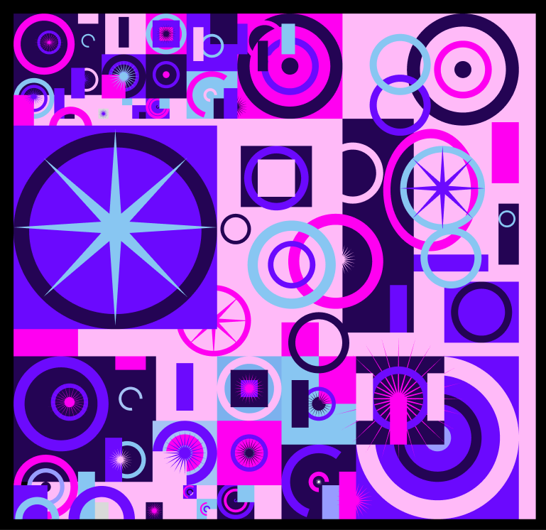

# ПЗ-3: Робота з простими формами та їх властивостями у Figma  
## Створення геометричного візерунку  

### Завдання  
Використовуючи прості фігури та їх властивості у Figma, створіть фрагмент геометричного візерунку.  
Приклади візерунків наведено в прикріплених матеріалах до завдання.  

### Виконане завдання  
Я створив фрагмент геометричного візерунку, використовуючи прості фігури та їх властивості у Figma.  

## Посилання на фігма
https://www.figma.com/design/pBmejyhmKP2ZtDRwQPIlUP/18.03.2025-%E2%84%963?node-id=0-1&p=f&t=wRVDJrLEQGCfwkPI-0

### Приклад візерунку  

  

  

### Процес створення у Figma  

  

